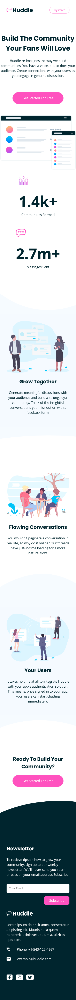
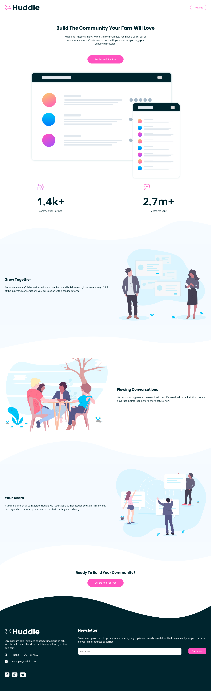

# Frontend Mentor - Huddle landing page with curved sections solution

This is a solution to the [Huddle landing page with curved sections challenge on Frontend Mentor](https://www.frontendmentor.io/challenges/huddle-landing-page-with-curved-sections-5ca5ecd01e82137ec91a50f2).

## Table of contents

- [Overview](#overview)
  - [The challenge](#the-challenge)
  - [Screenshot](#screenshot)
  - [Links](#links)
- [My process](#my-process)
  - [Built with](#built-with)
  - [What I learned](#what-i-learned)
  - [Useful resources](#useful-resources)
- [Author](#author)

## Overview

### The challenge

Users should be able to:

- View the optimal layout for the site depending on their device's screen size
- See hover states for all interactive elements on the page

### Screenshot

#### Mobile preview

#### Desktop preview

### Links

- [Github repo](https://github.com/nurmarief/fementor_huddle-landing-page-with-curved-sections/)
- [Live site](https://nurmarief.github.io/fementor_huddle-landing-page-with-curved-sections/)

## My process

### Built with

- Semantic HTML5 markup
- SASS
- BEM CSS
- CSS grid
- flexbox
- Mobile-first workflow
- Webpack 5
- jquery

### What I learned

- CSS pseudo-element: before, after
- CSS pseudo-class: nth-child, first-child

### Useful resources

- [fontawesome](fontawesome.com)

## Author

- [@nurmarief](https://www.frontendmentor.io/profile/nurmarief)
